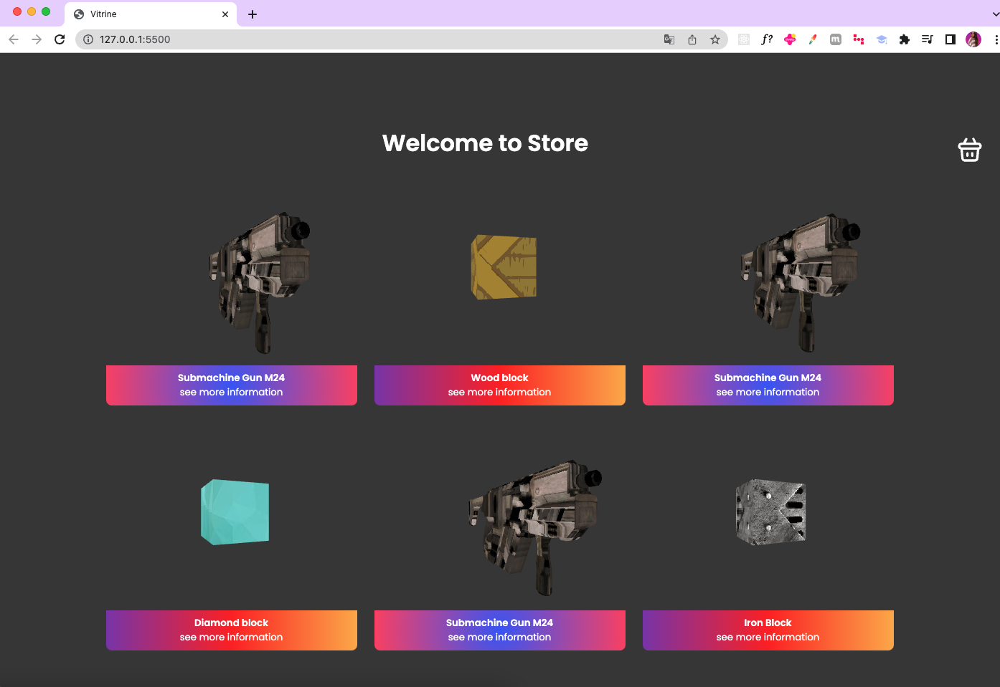

# Virtual Store WebGL
> This project is a web application built using WebGL technology that allows users to experience the simulation of a virtual store.

[![Javascript][javascript-badge]][javascript-url]
[![WebGL][webgl-badge]][webgl-url]
[![License][open-source-badge]][open-url]



## Development setup

```sh
git clone https://github.com/Fernanda-Kipper/virtual-store.git
```

Inside the path of the project, opem `index.html` file in the browser


## Contributing

1. Fork it (<https://github.com/yourname/yourproject/fork>)
2. Create your feature branch (`git checkout -b feature/fooBar`)
3. Commit your changes (`git commit -am 'Add some fooBar'`)
4. Push to the branch (`git push origin feature/fooBar`)
5. Create a new Pull Request

<!-- Markdown link & img dfn's -->
[wiki]: https://github.com/yourname/yourproject/wiki
[javascript-badge]: https://img.shields.io/badge/javascript-%23323330.svg?style=for-the-badge&logo=javascript&logoColor=%23F7DF1E
[javascript-url]: https://developer.mozilla.org/pt-BR/docs/Learn/JavaScript/First_steps/What_is_JavaScript
[webgl-badge]: https://img.shields.io/badge/WebGL-990000?logo=webgl&logoColor=white&style=for-the-badge
[webgl-url]: https://webgl2fundamentals.org/
[open-source-badge]: https://img.shields.io/github/license/Ileriayo/markdown-badges?style=for-the-badge
[open-url]: ./LICENSE

